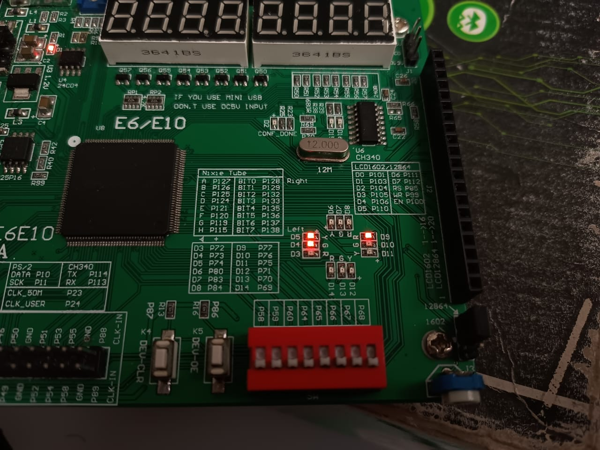
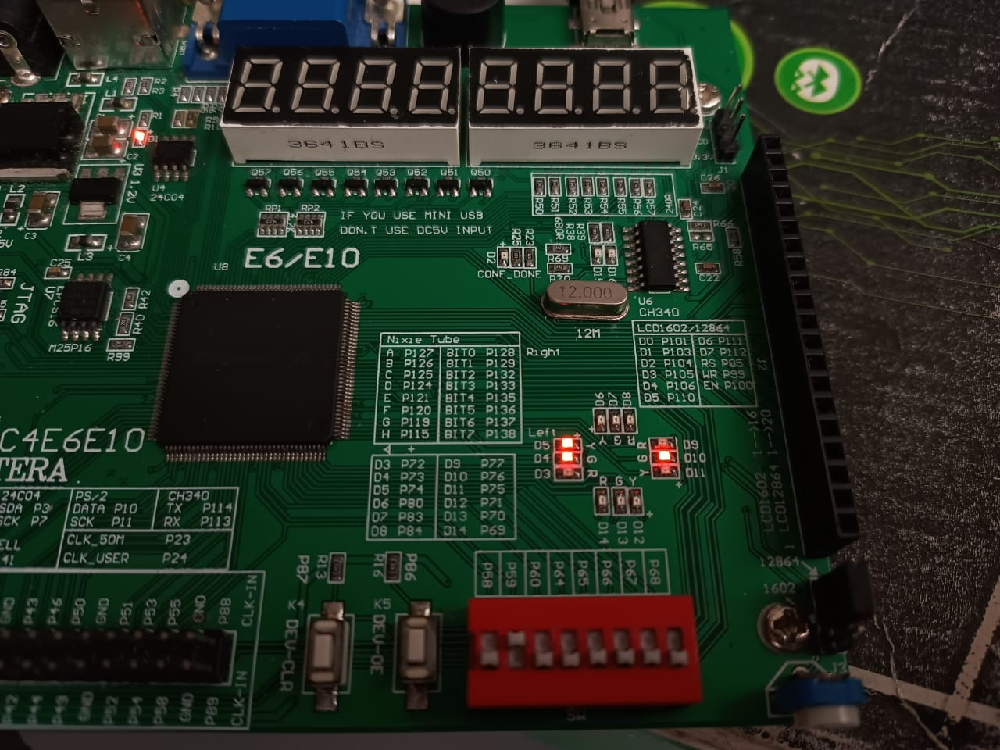
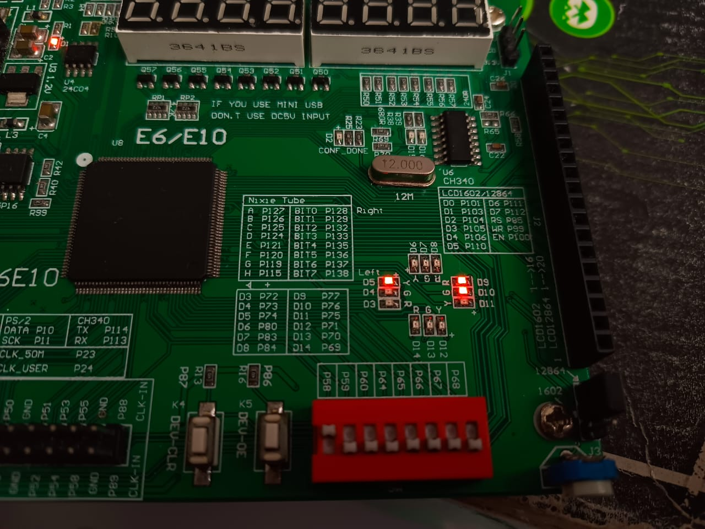
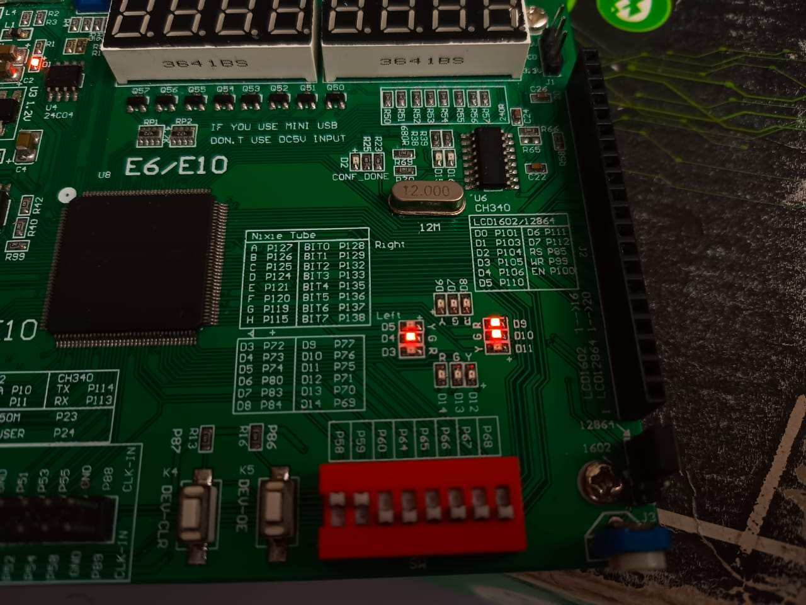

#  Laboratorio IV – Multiplexores, Demultiplexores y Decodificadores

## Integrantes

### Jairo David Diaz Luna

### Juan Angel Pinzon Lopez

### Erick Hosbany Calvache Pacheco

## Índice

1. [Introducción](#introducción)
2. [Objetivos](#objetivos)
3. [Herramientas y Materiales](#herramientas-y-materiales)
4. [Metodología](#metodología)
5. [Desarrollo del Laboratorio](#desarrollo-del-laboratorio)
   1. [Decodificador 2 ➜ 4](#decodificador-2-a-4)
   2. [Demultiplexor 1 ➜ 4](#demultiplexor-1-a-4)
   3. [Multiplexor 4 ➜ 1](#multiplexor-4-a-1)
6. [Resultados Experimentales](#resultados-experimentales)
7. [Conclusiones](#conclusiones)
8. [Referencias](#referencias)

---

## Introducción

En la electrónica digital, el *enrutamiento de señales* mediante componentes combinacionales es fundamental para el diseño de sistemas complejos. Entre los bloques más representativos se encuentran:

- *Decodificador*: traduce un valor binario en una única línea de salida activa.
- *Demultiplexor* (DEMUX): reenvía una señal de entrada hacia una de varias salidas según bits de control.
- *Multiplexor* (MUX): realiza la operación inversa, seleccionando una de varias señales de entrada para presentarla en una única salida.

Este proyecto documenta el diseño, simulación e implementación en FPGA de:

> *Decodificador 2 ➜ 4, **DEMUX 1 ➜ 4 con señales diferenciadas* y *MUX 4 ➜ 1 con salidas constantes y pulsantes*.

Se incluyen tablas de verdad, diagramas, resultados experimentales e indicaciones de cómo acceder al código fuente correspondiente a cada módulo.

---

## Objetivos

- *Diseñar* en Verilog un decodificador 2 ➜ 4, un demultiplexor 1 ➜ 4 y un multiplexor 4 ➜ 1.
- *Simular* cada módulo para verificar su lógica antes de la síntesis.
- *Implementar* los diseños en una FPGA Cyclone IV y verificar su funcionamiento físico con switches y LEDs.
- *Analizar* diferencias prácticas entre decodificación, demultiplexación y multiplexación.

---

## Herramientas y Materiales

| Recurso        | Descripción                                       |
|----------------|---------------------------------------------------|
| FPGA           | Tarjeta Cyclone IV EP4CE6E22C8N @ 50 MHz           |
| Software       | Quartus II 13.1 + ModelSim Altera Edition         |
| Lenguaje HDL   | Verilog                                           |
| Periféricos    | 4 switches DIP, 8 LEDs, reloj interno de 50 MHz    |
| Instrumentación| Osciloscopio digital (verificación de frecuencias)|

---

## Metodología

1. *Diseño lógico* a partir de tablas de verdad y diagramas.
2. *Codificación HDL* para cada módulo en archivos separados (decoder2x4.v, demux_signals_4.v, mux4to1_special.v).
3. *Simulación* con bancos de prueba en ModelSim asegurando la corrección funcional.
4. *Síntesis* y *asignación de pines* en Quartus II.
5. *Programación de la FPGA* y *pruebas físicas* usando switches y LEDs.
6. *Documentación* en formato Markdown (este README) con evidencias gráficas y análisis.

---

## Desarrollo del Laboratorio

### Decodificador 2 a 4

#### Descripción Funcional

Convierte un código binario de 2 bits en una única línea de salida activa (uno‑de‑cuatro). Se utiliza para selección de dispositivos o direccionamiento.

#### Tabla de Verdad

| A1 | A0 | Y3 | Y2 | Y1 | Y0 |
|:--:|:--:|:--:|:--:|:--:|:--:|
| 0  | 0  | 0  | 0  | 0  | 1  |
| 0  | 1  | 0  | 0  | 1  | 0  |
| 1  | 0  | 0  | 1  | 0  | 0  |
| 1  | 1  | 1  | 0  | 0  | 0  |

#### Código Fuente

> El código completo se encuentra en **decoder2x4.v** dentro de la carpeta raíz del repositorio.

#### Evidencia Fotográfica

---

### Demultiplexor 1 a 4

#### Descripción Funcional

El DEMUX direcciona la entrada D hacia una de cuatro salidas según S1S0. Cada salida entrega una señal distinta:

| Canal | Señal de Salida |
|-------|-----------------|
| ch0   | 0 constante     |
| ch1   | Pulso 1 Hz      |
| ch2   | Pulso 10 Hz     |
| ch3   | 1 constante     |

#### Código Fuente

> Consulta **demux_signals_4.v** para el listado Verilog detallado que genera los pulsos y distribuye las señales.

#### Evidencia Fotográfica

---

### Multiplexor 4 a 1

#### Descripción Funcional

Selecciona una de cuatro señales de entrada para presentarla en la salida out según sel[1:0].

| sel | Señal Seleccionada | Comportamiento Observado |
|-------|-------------------|--------------------------|
| 00    | 0 constante       | LED apagado              |
| 01    | Pulso 1 Hz        | Parpadeo lento           |
| 10    | Pulso 10 Hz       | Parpadeo rápido          |
| 11    | 1 constante       | LED encendido            |

> Nota: La placa invierte el orden físico de los switches; ten en cuenta la polaridad al interpretar sel.

#### Código Fuente

> El listado completo está disponible en **mux4to1_special.v**. Incluye generación de los pulsos 1 Hz y 10 Hz mediante divisores de frecuencia.

#### Evidencia Fotográfica

selector_en_00.jpg)
selector_1_0.jpg)
_%20selector_0_1.jpg)
_selector_1_1.jpg)

---

## Resultados Experimentales

- *Decodificador* · Se verificó que para cada combinación de A1A0 se iluminó *exactamente un* LED de salida, corroborando la decodificación uno‑de‑cuatro.
- *DEMUX* · Con D = 1, la señal se encaminó correctamente a la salida seleccionada (ch0..ch3). Al poner D = 0, todas las salidas permanecieron en bajo.
- *MUX* · El LED de salida mostró los cuatro patrones esperados: apagado, parpadeo 1 Hz, parpadeo 10 Hz y encendido continuo.
- *Frecuencias* · Con osciloscopio se midieron 0,99 Hz y 10,0 Hz para las señales pulsantes, validando los divisores de reloj.

---

## Conclusiones

1. Los tres módulos fueron *diseñados, simulados e implementados* con éxito en la FPGA.
2. La prueba física evidenció la importancia de considerar *polaridades inversas* de switches y LEDs al mapear pines.
3. El ejercicio reforzó la diferencia práctica entre *decodificar, **demultiplexar* y *multiplexar* señales.
4. El uso de señales pulsantes demostró la interacción entre lógica combinacional y temporal dentro de un mismo diseño.
5. La metodología empleada —diseño teórico, simulación, síntesis y validación— se confirma como un flujo robusto para proyectos digitales futuros.

---

## Referencias

1. M. M. Mano, Digital Design, 5.ª ed., Pearson, 2017.
2. Intel FPGA, Cyclone IV EP4CE6E22C8N Device Handbook.
3. Quartus II User Guide, Intel, 2023.

---