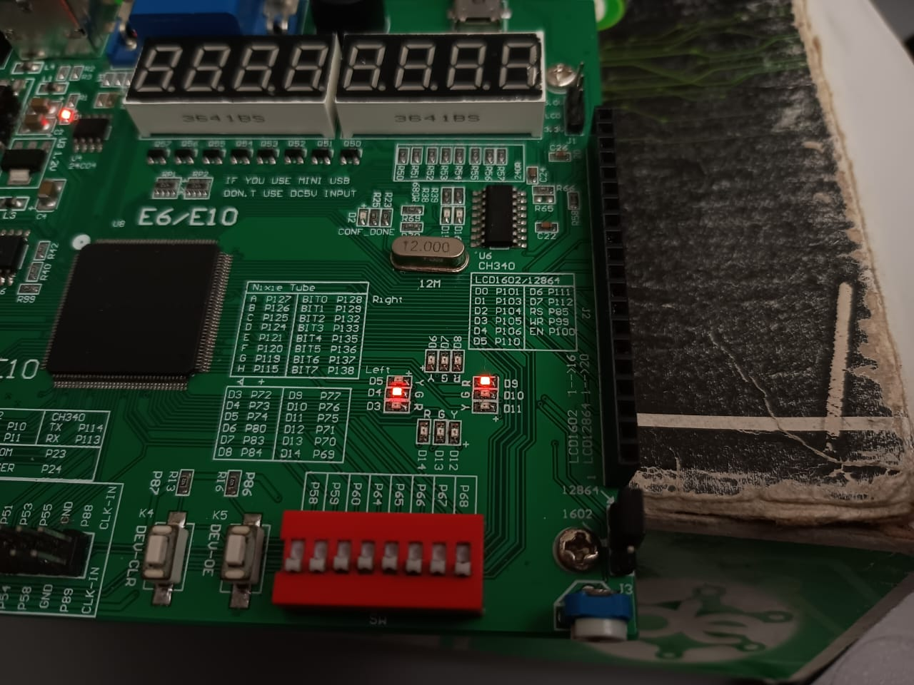

#  Laboratorio IV – Multiplexores, Demultiplexores y Decodificadores

## Integrantes

### Jairo David Diaz Luna

### Juan Angel Pinzon Lopez

### Erick Hosbany Calvache Pacheco

## Índice

1. [Introducción](#introducción)
2. [Objetivos](#objetivos)
3. [Herramientas y Materiales](#herramientas-y-materiales)
4. [Metodología](#metodología)
5. [Desarrollo del Laboratorio](#desarrollo-del-laboratorio)
   1. [Decodificador 2 ➜ 4](#decodificador-2-a-4)
   2. [Demultiplexor 1 ➜ 4](#demultiplexor-1-a-4)
   3. [Multiplexor 4 ➜ 1](#multiplexor-4-a-1)
6. [Resultados Experimentales](#resultados-experimentales)
7. [Conclusiones](#conclusiones)
8. [Referencias](#referencias)

---

## Metodología

1. *Diseño lógico* a partir de tablas de verdad y diagramas.
2. *Codificación en verilog HDL* para cada módulo en archivos separados (decoder2x4.v, demux_signals_4.v, mux4to1_special.v).
4. *Síntesis* y *asignación de pines* en Quartus II.
5. *Programación de la FPGA* y *pruebas físicas* usando switches y LEDs.
6. *Documentación* en formato Markdown (este README) con evidencias gráficas y análisis.

---

## Desarrollo del Laboratorio

### Decodificador 2 a 4

#### Descripción Funcional

Convierte un código binario de 2 bits en una única línea de salida activa (uno‑de‑cuatro). Se utiliza para selección de dispositivos o direccionamiento.

#### Tabla de Verdad

| A1 | A0 | Y3 | Y2 | Y1 | Y0 |
|:--:|:--:|:--:|:--:|:--:|:--:|
| 0  | 0  | 0  | 0  | 0  | 1  |
| 0  | 1  | 0  | 0  | 1  | 0  |
| 1  | 0  | 0  | 1  | 0  | 0  |
| 1  | 1  | 1  | 0  | 0  | 0  |

#### Código Fuente

> El código completo se encuentra en **decoder2x4.v** .

#### Evidencia Fotográfica

---

### Demultiplexor 1 a 4

#### Descripción Funcional

El DEMUX direcciona la entrada D hacia una de cuatro salidas según S1S0. Cada salida entrega una señal distinta:

| Canal | Señal de Salida |
|-------|-----------------|
| ch0   | 0 constante     |
| ch1   | Pulso 1 Hz      |
| ch2   | Pulso 10 Hz     |
| ch3   | 1 constante     |

#### Código Fuente

> En **demux_signals_4.v** se encuentra el codigo usado.

#### Evidencia Fotográfica

---

### Multiplexor 4 a 1

#### Descripción Funcional

Selecciona una de cuatro señales de entrada para presentarla en la salida out según sel[1:0].

| sel | Señal Seleccionada | Comportamiento Observado |
|-------|-------------------|--------------------------|
| 00    | 0 constante       | LED apagado              |
| 01    | Pulso 1 Hz        | Parpadeo lento           |
| 10    | Pulso 10 Hz       | Parpadeo rápido          |
| 11    | 1 constante       | LED encendido            |

> Nota: La placa invierte el orden físico de los switches.

#### Código Fuente

> El codigo completa esta en **mux4to1_special.v**. Incluye generación de los pulsos 1 Hz y 10 Hz mediante divisores de frecuencia.

#### Evidencia Fotográfica

selector_en_00.jpg)
selector_1_0.jpg)
_%20selector_0_1.jpg)
_selector_1_1.jpg)

---

## Resultados Experimentales

- *Decodificador* · Se verificó que para cada combinación de A1A0 se iluminó *exactamente un* LED de salida, corroborando la decodificación uno‑de‑cuatro.
- *DEMUX* · Con D = 1, la señal se encaminó correctamente a la salida seleccionada (ch0..ch3). Al poner D = 0, todas las salidas permanecieron en bajo.
- *MUX* · El LED de salida mostró los cuatro patrones esperados: apagado, parpadeo 1 Hz, parpadeo 10 Hz y encendido continuo.

---

## Conclusiones

1. Los tres módulos fueron *diseñados, simulados e implementados* con éxito en la FPGA.
2. La prueba física evidenció la importancia de considerar *polaridades inversas* de switches y LEDs al mapear pines.
3. El ejercicio reforzó la diferencia práctica entre *decodificar, **demultiplexar* y *multiplexar* señales.
4. El uso de señales pulsantes demostró la interacción entre lógica combinacional y temporal dentro de un mismo diseño.
