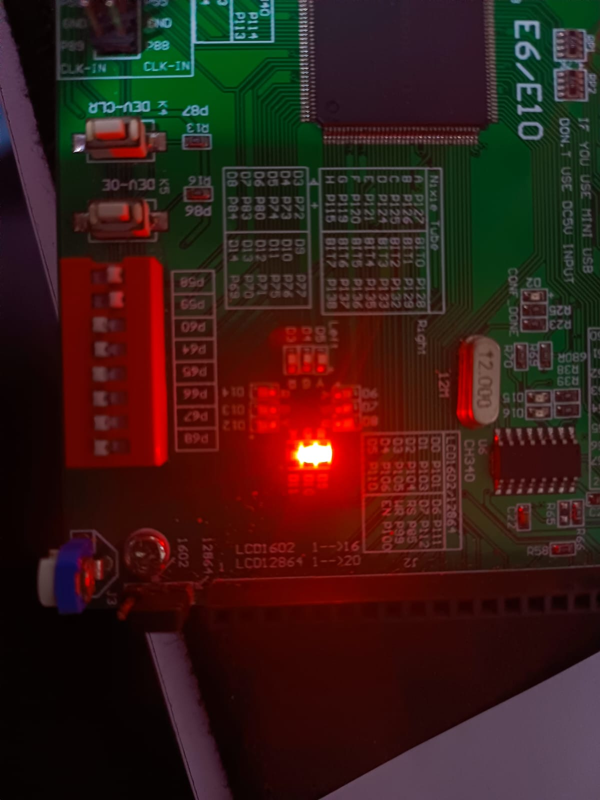

# Tercera práctica de laboratorio Verilog

## Integrantes

- Jairo David Diaz Luna
- Juan Angel Pinzon Lopez
- Erick Hosbany Calvache Pacheco

---

## Descripción

Implementación en FPGA (Verilog) de los siguientes módulos y evidencia de laboratorio:

1. **Comparador de dos bits**  
2. **Medio sumador (Half Adder)**  
3. **Sumador completo (Full Adder)**  
4. **Inversor en anillo (TTL, FPGA)**  

---

## 1. Comparador de dos bits

**Código:** [`comparador_2_bits.v`](./comparador_2_bits.v)

| Caso  | Imagen                                    |
|-------|-------------------------------------------|
| A = B |  |
| A > B |  |
| A < B |  |

---

## 2. Medio sumador (Half Adder)

**Código:** [`Half_adder.v`](./Half_adder.v)

| Entradas     | Imagen                               |
|--------------|--------------------------------------|
| A=0, B=0     |  |
| A=1/B=1      |  |

---

## 3. Sumador completo (Full Adder)

**Código:** [`full_adder.v`](./full_adder.v)

| A | B | Cin | Imagen                                  |
|---|---|-----|-----------------------------------------|
| 0 | 0 | 0   |      |
| 0 | 0 | 1   |      |
| 0 | 1 | 0   |      |
| 1 | 1 | 1   |      |

---

## 4. Inversor en anillo

**Código:** [`anillo.v`](./anillo.v)

| Implementación       | Imagen                                 |
|---------------------|----------------------------------------|
| TTL (osciloscopio)  |  |

---
